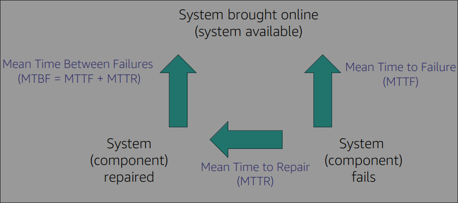

# --Study areas--

## 5.2
Q: Which of the following describers a monetary loss if one event occurs
A. **ALE** <u>Annual loss expectancy</u> - How much money you lose in a span of 12 months
B. **SLE** <u>single loss expectancy</u> - money loss if one event occurs, like a server going down
C. **RTO** <u>Recovry time objective</u> - how fast you can get everything ready if event occurs ... How long it takes to get service up
    **PO** <u>Recovery point objective</u> - How much tolerance you have / how much data you're willing to lose until action needs to be taken
D. **ARO** <u>annualized rate of occurance</u> - event frequency / how many times a server crashes in a span of time
extra: MTTR Mean time to repair 

## Study port numbers

- 20, 21
- 22
- 23
- 25
- 53
- 67/68
- 80/443
- 110
- 143
- 161
- 389
- 445
- 514
- 1433
- 3389

## IT structure

